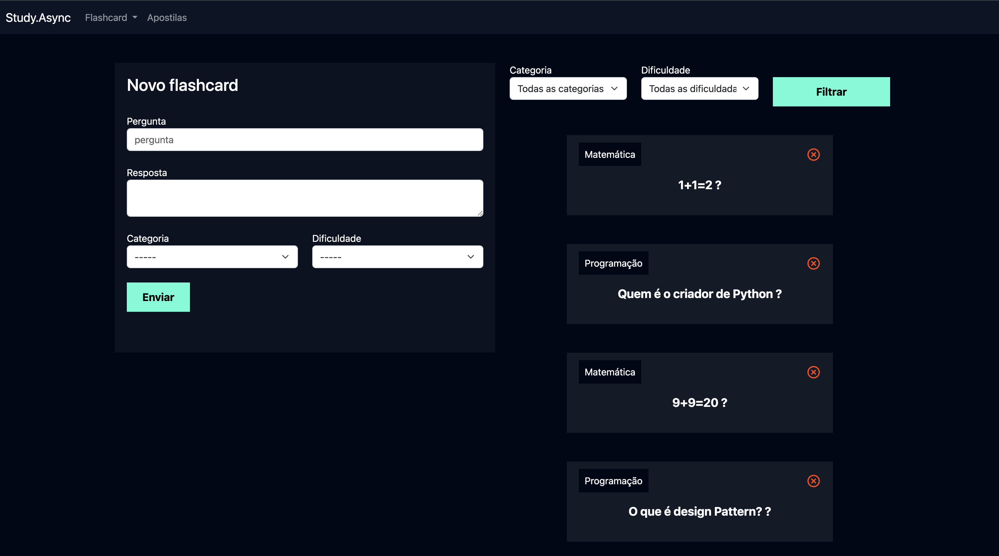
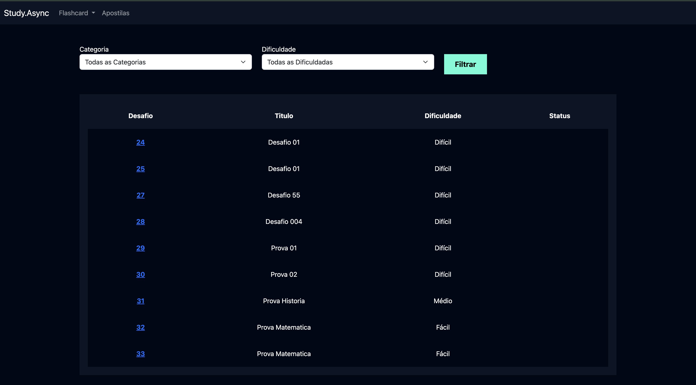
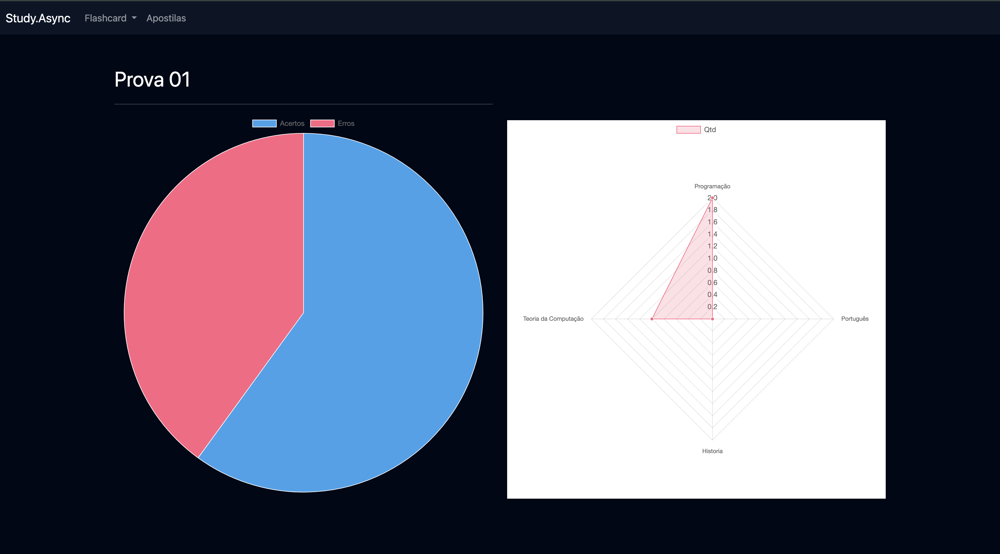
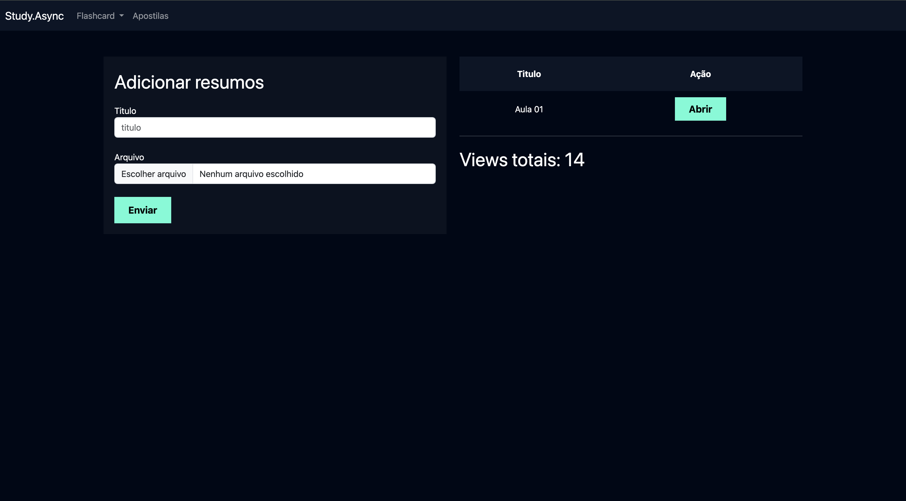

# 🇧🇷 and 🏴󠁧󠁢󠁥󠁮󠁧󠁿

 



# 🇧🇷 Introdução
  Esta é uma base de dados que abriga um portal de estudos, composto por cartões de memória (Flashcards), desafios envolvendo Flashcards e material didático. O usuário tem a capacidade de incorporar tanto os Flashcards quanto os desafios e apostilas. O sistema utiliza um banco   de dados em sqlite3 e o projeto foi inteiramente desenvolvido em Django.

  ## O que é necessário? 
  É necessário ter python instalado em sua máquina. Instale aqui: [](https://www.python.org/downloads/)

  ## Como usar?
  1. Clone o repositório em sua máquina
  2. Na sua IDE abra a pasta [study_psw]
  3. Inicie o ambiente virtual através do terminal de sua IDE
     
<br> MacOS or Linux
```
source venv/bin/activate
```
<br> Windows
```
venv\Scripts\Activate
```
<br>

  4. Para testar basta iniciar o projeto através do terminal de sua IDE com o seguinte comando
<br> Todas as plataformas
```
python3 manage.py runserver
```

  ### Apps no programas
  - [x] Flashcards
      Contém as páginas: Novo Flashcard / Iniciar Desafio / Desafio / Listar Desafio 
  - [x] Usuarios
      Contém as páginas de cadastro e login de usuários
  - [x] Apostilas
      Contém as páginas de Apostila e Adicionar Apostilas  

# 🏴󠁧󠁢󠁥󠁮󠁧󠁿 Introducion
  This is a repository hosting a study platform featuring Flashcards, Flashcard Challenges, and Study Guides. Users can seamlessly integrate both Flashcards and challenges, as well as study guides. The system utilizes an sqlite3 database and the entire project is crafted using    Django.

   ## What is required? 
  You need python installed on your machine. Install it here: [](https://www.python.org/downloads/)

  ## How to use?
  1. Clone the repository on your machine
  2. In your IDE open the [study_psw] folder
  3. Start the virtual environment using your IDE's terminal
<br> MacOS or Linux
```
source venv/bin/activate
```
<br> Windows
```
venv\Scripts\Activate
```
<br>

  4. To test, simply start the project via your IDE's terminal with the following command
<br> All plataform
```
python3 manage.py runserver
```

  ### Apps in programs
  - [x] Flashcards
      Contains the pages: New Flashcard (Novo_Flashcard) / Start Challenge (iniciar_desafio) / Challenge (desafio) / List Challenge (Listar_Desafio
  - [x] Users
      Contains the user registration and login pages
  - [x] Handouts
      Contains the Handouts (Apostila) and Add Handouts (Adicionar_Apostila) pages  )
